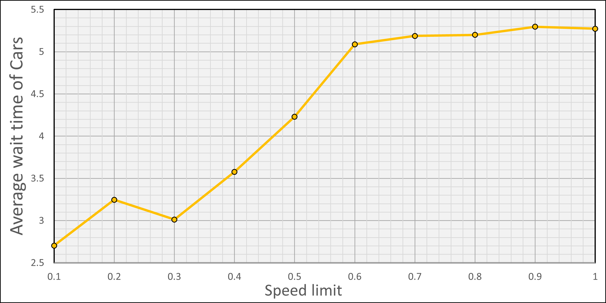
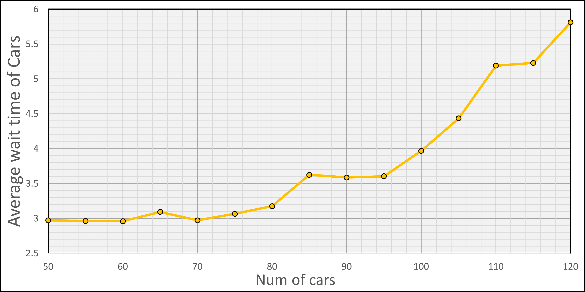
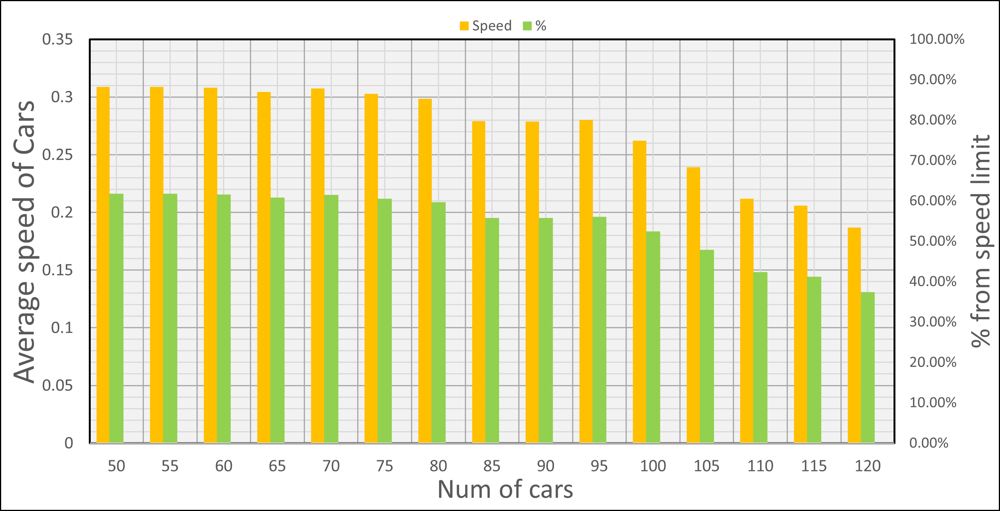
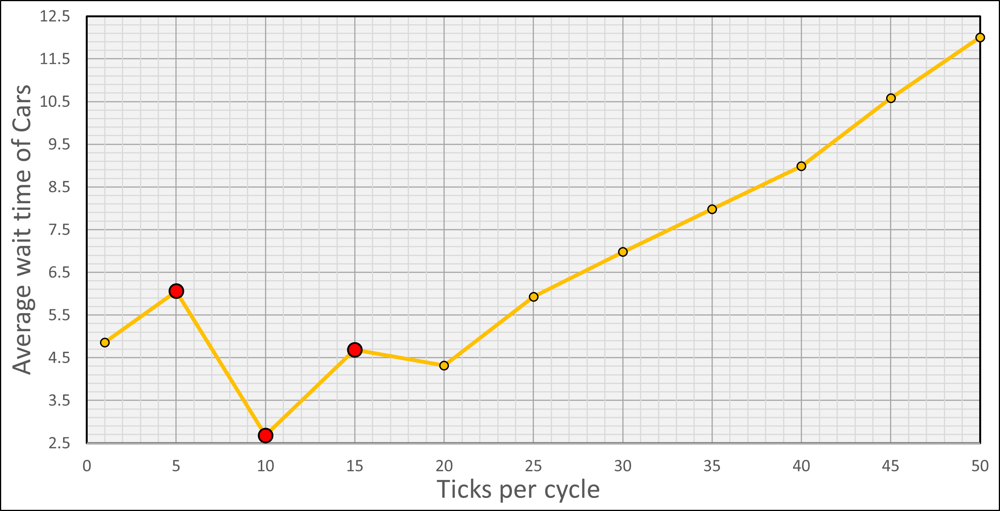

# Комп'ютерні системи імітаційного моделювання

СПм-22-6, Олійник Дмитро Геннадійович
 
Лабораторна робота №1. Опис імітаційних моделей та проведення обчислювальних експериментів

Варіант 1, модель у середовищі NetLogo: [Traffic Grid](http://www.netlogoweb.org/launch#http://www.netlogoweb.org/assets/modelslib/Sample%20Models/Social%20Science/Traffic%20Grid.nlogo)

## Вербальний опис моделі:
Модель міського трафіку за схемою сітки. Вона дозволяє керувати світлофорами та глобальними змінними, такими як обмеження швидкості та кількість автомобілів, а також досліджувати динаміку руху.

На кожному кроці автомобілі намагаються рухатися вперед з поточною швидкістю. Якщо їхня поточна швидкість менша за дозволену і перед ними немає інших автомобілів, вони прискорюються. Якщо перед ними є повільніший автомобіль, вони підлаштовуються під швидкість повільнішого автомобіля і сповільнюються. Якщо перед ними червоне світло або зупинена машина, вони зупиняються.

## Керуючі параметри:
- ***grid-size-X*** - кількість горизонтальних ліній доріг
- ***grid-size-Y*** - кількість вертикальних ліній доріг
- ***num-cars*** - кількість машин, що приймають участь у моделюванні
- ***power*** - наявність електроенергії, впливає на роботу світлофорів
- ***ticks-per-cycle*** - кількість кроків у циклів, впливає на часові проміжки між перемиканням сигналів світлофорів
- ***speed-limit*** - максимальна швидкість автомобілів
- ***current-auto*** - параметр, що відповідає за автоматичне перемикання світлофорів на поточному перехресті
- ***current-phase*** - параметр, що відповідає за зміщення перемикання світлофорів на поточному перехресті у часі
- ***change light*** - параметр, який дозволяє примусово смінити колір світлофору

## Внутрішні параметри:
#### Глобальні параметри:
- ***acceleration*** - константа, що відповідає за прискорення всих машин
- ***grid-x-inc*** - кількість "патчів" між двома дорогами за *х* координатами
- ***grid-y-inc*** - кількість "патчів" між двома дорогами за *у* координатами
- ***num-cars-stopped*** - лічильник, що рахує кількість зупинених машин та кількість машин, що стоять, на поточному кроці моделювання 
- ***phase*** - лічильник поточної фази циклу перемикань світлофорів

#### Параметри машин (turtle)
- ***speed*** - швидкість машини
- ***up-car*** - напрямок руху машини (униз, вправо)
- ***wait-time*** - лічильник, що рахує кількість часу, що минуло після останнього руху 

#### Параметри доріг/ділянок (patch)
- ***intersection*** - *правда*, якщо ділянка знаходиться на перехресті двох доріг;
- ***green-light-up*** - *правда*, якщо зелене світло над перехрестям, інакше - *неправда*;
- ***my-row*** - рядок перехрестя, -1 для ділянок, що не перетинаються.
- ***my-column*** - стовпець перехрестя, -1 для ділянок, що не перетинаються.
- ***my-phase*** - фаза перехрестя
- ***auto*** - параметр, що відповідає за автоматичне перемикання перехрестя. *неправда* для ділянок без перехресть.

## Показники роботи системи:

- ***Stopped cars*** - відображає кількість зупинених автомобілів на кожному кроці моделювання
- ***Average Speed of Cars*** - відображає середню швидкість автомобілів на кожному кроці моделювання
- ***Average Wait Time of Cars*** - відображає середній час очікування автомобілів для початку руху на кожному кроці моделювання

## Примітки:

При запуску моделювання із параметрами за замовчуванням часто виникає ситуація тимчасового блокування перехрестя, коли горить зелене світло світлофору для автомобіля, але він не має змоги їхати через затор, що проходить через це перехрестя у іншому напрямку.

## Недоліки моделі:

- Наявно лише два світла світлофору, що не дає змогу прискоритись ще сильшіше та проскочити перехрестя, почати завчасно гальмувати або ж почати рух на жовтий колір світлофору. 
- Тривалість сигналів світлофорів завжди є однаковою, тому немає можливості більш точного налаштування моделі.
- Сітка міської дороги є циклічною, що при певних налаштуваннях моделі (велике транспортне навантаження) призводить до повного паралічу руху незалежно від наявності електроенергії.
- За прискорення та гальмування відповідає тільки один параметр *acceleration*, що, звісно, не відповідає реальному досвіду.
- Гальмування починається тільки безпосередньо перед перешкодою (автомобіль), що не відповідає реальному досвіду, проте доцільно враховувати наявність перешкод на більшій відстані та скидати швидкість поступово по мірі наближення.
- Гальмування при червоному світлі світлофору відбувається моментально - не відповідає реальному досвіду.
- Коли електроенергія відсутня, то машини починають рухатися не за ПДР (правила регульованих та нерегульованих перехресть).

***

## Обчислювальні експерименти

### Експеримент №1. Залежність середнього часу очікування від обмежень швидкості руху

*Початкові умови:*
- *Grid size x_y =* **3**
- *Power =* **true**
- *Num cars =* **100**
- *Ticks per cycle =* **20**

*Результати експерименту:*

| Speed limit   | Wait          |
|:---:          |:---:          |
|       0.1     |   2.703488256 |
|       0.2     |   3.246216892 |
|       0.3     |   3.012508746 |
|       0.4     |   3.576886557 |
|       0.5     |   4.230689655 |
|       0.6     |   5.088395802 |
|       0.7     |   5.187106447 |
|       0.8     |   5.199235382 |
|       0.9     |   5.295362319 |
|       1.0     |   5.27185907  |

*Висновки:* з графіку видно, що збільшення максимальної швидкості - збільшує середній час очікування на рух, що є цілком природнім, адже дає водієві можливість швидше доїхати до світлофору й почати очікування. Починаючи із обмеження швидкості, що дорівнює 0.6 - відсутнє знчне підвищення часу очікування. Проте, спостерігається аномалія при багаторазовому моделюванні із обмеження швидкості 0.2, яке має більший час очікування, ніж сусідні значення.

***

### Експеримент №2. Залежність середнього часу очікування та середньої швидкості руху від кількості автомобілів на дорозі

*Початкові умови:*
- *Grid size x_y =* **3**
- *Power =* **true**
- *Speed limit =* **0.5** 
- *Ticks per cycle =* **20**

*Результати експерименту:*

|Num of cars	|Wait	          |Speed           |Speed from max|
|:-------------:|-----------------|----------------|:------------:|
|       50	    |   2.971464268   |  0.30876015    |    61.75%    |
|       55	    |   2.96304575    |  0.308800763   |    61.76%    |
|       60	    |   2.959478594   |  0.308020698   |    61.60%    |
|       65	    |   3.093261062   |  0.304265506   |    60.85%    |
|       70	    |   2.971407154   |  0.307438174   |    61.49%    |
|       75	    |   3.065907046   |  0.302620243   |    60.52%    |
|       80	    |   3.174494003   |  0.298535326   |    59.71%    |
|       85	    |   3.624305494   |  0.278957292   |    55.79%    |
|       90	    |   3.58707313    |  0.278850625   |    55.77%    |
|       95	    |   3.603724454   |  0.28027593    |    56.06%    |
|       100	    |   3.969685157   |  0.262143138   |    52.43%    |
|       105	    |   4.43386878    |  0.239238933   |    47.85%    |
|       110	    |   5.18901004    |  0.211705334   |    42.34%    |
|       115	    |   5.229228864   |  0.205914178   |    41.18%    |
|       120	    |   5.81021989    |  0.186875462   |    37.38%    |

*Висновки:* З графіку видно чітку картину - чим більше завантаженність дороги, тим більший час очікування. Проте, в інтервалі 50-75 машин, не спостерігається явного підвищення часу очікування, тобто цю кількість автомобілів така конфігурація моделі обробляє однаково гарно.
Також із графіків швидкості видно, що при кількості автомобілів 50-75 швидкість автомобілів не сильно відрізняється та становить 60.52-61.76 % від максимальної. Таким чином, рух з мінімальним часом очікування та з максимально можливою швидкістю можливий при кількості автомобілів рівною 50-75.

***

### Експеримент №3. Залежність середнього часу очікування від проміжку часу між змінами сигналів світлофорів

*Початкові умови:*
- *Grid size x_y* = 3
- *Power* = true
- *Num cars* = 100
- *Ticks per cycle* = 20

*Результати експерименту:*

*Висновки:* З графіку видно, що найбільш оптимальним, з точки зору середнього часу очікування, є значення 20 для світлофорів, а зі збільшенням, чи зменшенням часу між зміною кольорів світлофору, відносно значення 20, середній час очікування збільшується. Треба зауважити, що при значеннях 5, 10, 15, які позначені червоним кольором на графіку, типовою ситуацією є сильні коливання часу очікування (створення тривалих заторів) та повного паралічу трафіку при моделюванні, тому для цих значень було обрано найбільш вдалі спроби з більш-менш рівномірним розподілом.