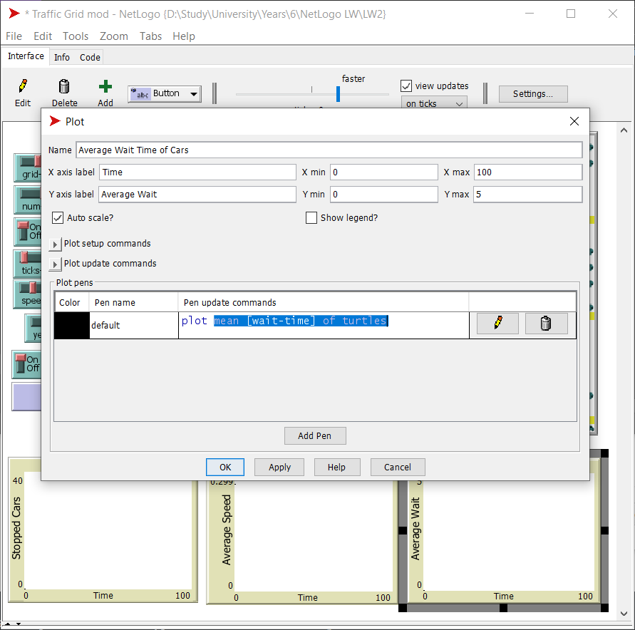
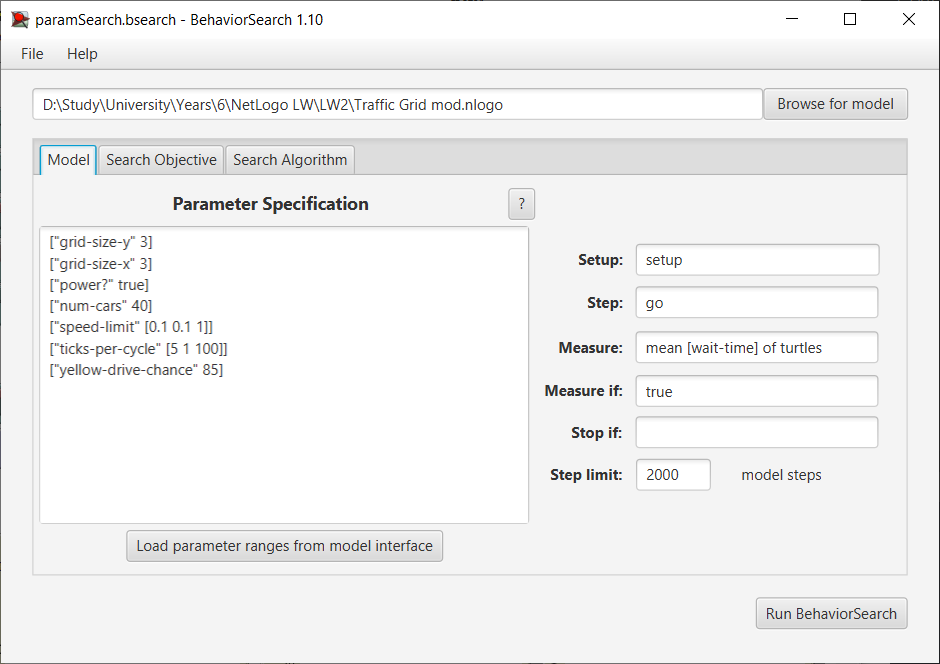
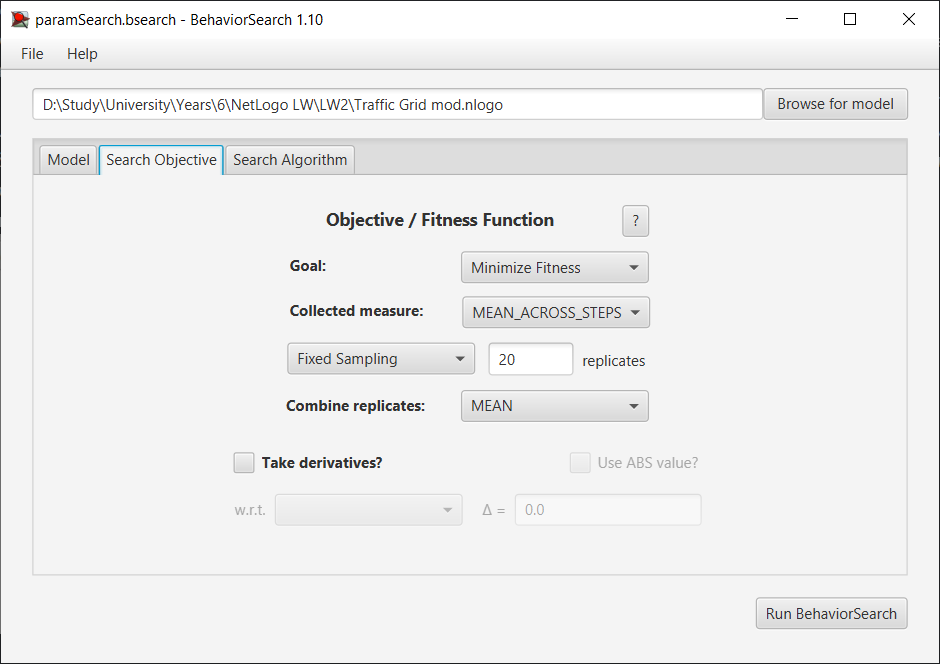
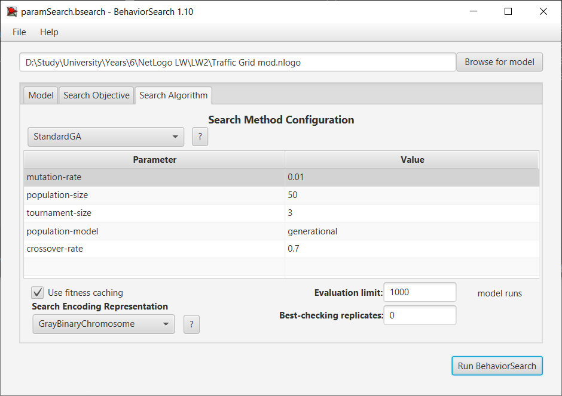
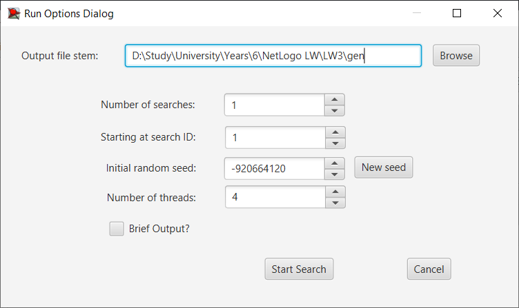
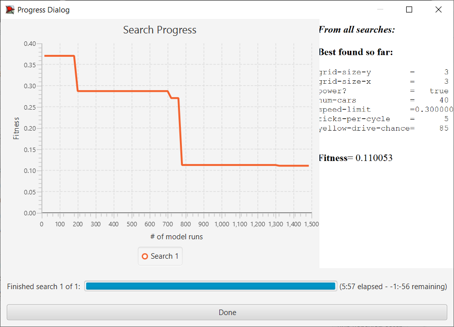
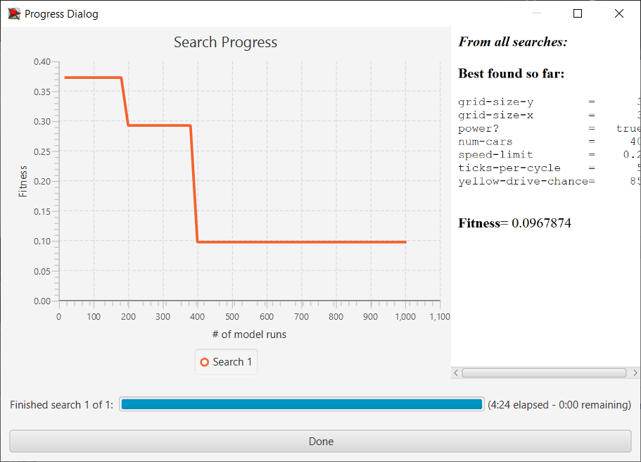
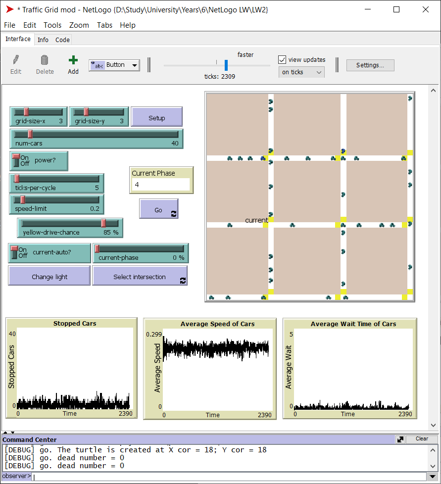

# Комп'ютерні системи імітаційного моделювання

СПм-22-6, Олійник Дмитро Геннадійович
 
Лабораторна робота №3. Використання засобів обчислювального интелекту для оптимізації імітаційних моделей

Варіант 1, модель у середовищі NetLogo: [Traffic Grid](http://www.netlogoweb.org/launch#http://www.netlogoweb.org/assets/modelslib/Sample%20Models/Social%20Science/Traffic%20Grid.nlogo)

Вербальний опис обраної моделі знаходиться у [1 лабораторній роботі](/LW1/Laboratory_work_1.md#Вербальний-опис-моделі).

## Налаштування середовища BehaviorSearch

Параметри моделі (вкладка Model):

</br>["grid-size-y" 3]
</br>["grid-size-x" 3]
</br>["power?" true]
</br>["num-cars" 40]
</br>["speed-limit" [0.1 0.1 1]]
</br>["ticks-per-cycle" [5 1 100]]
</br>["yellow-drive-chance" 85]

Використовувана міра:
У якості цільової функції було обрано значення середнього часу очікування машин до початку руху, вираз для її розрахунку взято з налаштувань графіка аналізованої імітаційної моделі в середовищі NetLogo 



та вказано у параметрі "Measure":

``` NetLogo
mean [wait-time] of turtles
```

Середній час очікування всіх машин повинен враховуватися в середньому за весь період симуляції тривалістю, для приклада, 2000 тактів (адже на кожному такті є своє значення поточної середньої швидкості усіх учасників дорожного руху), починаючи з 0 такту симуляції.

Параметр *"Mesure if"* має значення *true*, бо нам цікаве кожне значення показника.

Параметр зупинки за умовою *"Stop if"* не використовувався.

Загальний вигляд вкладки налаштувань параметрів моделі:



## Налаштування цільової функції (вкладка Search Objective):

Метою підбору параметрів імітаційної моделі, що описує дорожній рух, є мінімізація значення середнього часу очікування перед початком руху – це вказано через параметр *"Goal"* зі значенням *Minimize Fitness*. Тобто необхідно визначити такі параметри налаштувань моделі, у яких машини рухаються із найкоротшими зупинками. При цьому цікавить середній час очікування за всю симуляцію (тривалість якої (2000 кроків) вказувалася на минулій вкладці). Для цього у параметрі *"Collected measure"*, що визначає спосіб обліку значень обраного показника, вказано *MEAN_ACROSS_STEPS*.

Щоб уникнути викривлення результатів через випадкові значення, що використовуються в логіці самої імітаційної моделі, кожна симуляція повторюється по 20 разів, результуюче значення розраховується як середнє арифметичне.

Загальний вигляд вкладки налаштувань цільової функції:



## Налаштування алгоритму пошуку (вкладка Search Algorithm):

Загальний вид вкладки налаштувань алгоритму пошуку:



## Результати використання BehaviorSearch



Результат пошуку параметрів імітаційної моделі, використовуючи генетичний алгоритм:


Результат пошуку параметрів імітаційної моделі, використовуючи випадковий пошук:


## Перевірка результатів


